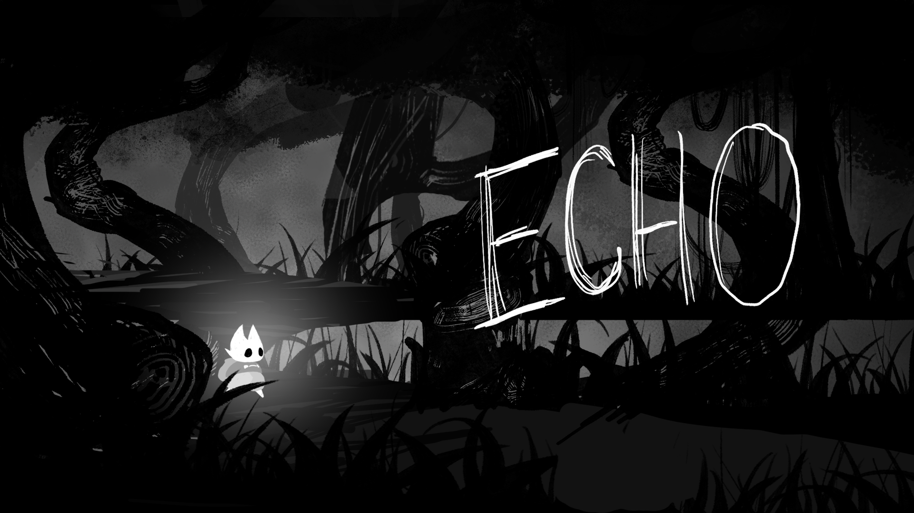
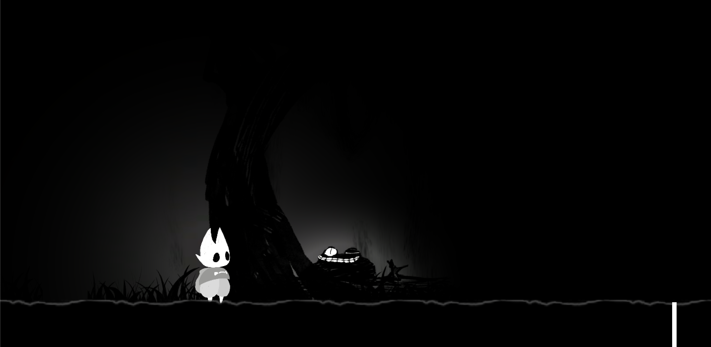
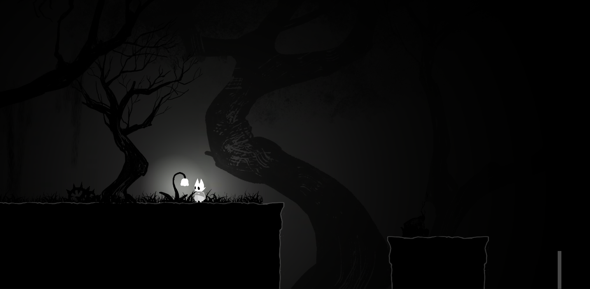
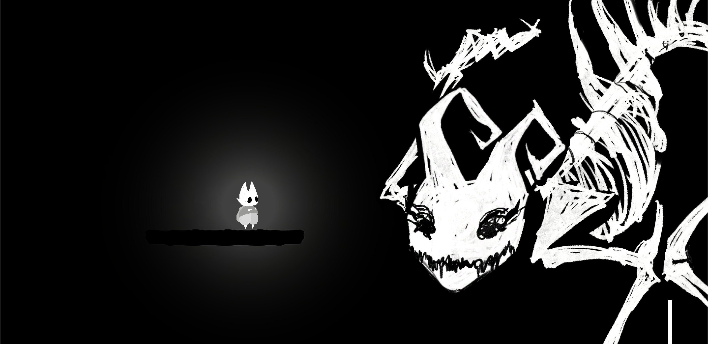

# Echo

A 2D side scroller RPG game concept developed in Unity as a submission to Global Game Jam 2020.  
### The Team:
- Justin Lui (Developer)
- Kelvin Zhao (Developer)
- Alexa Gogoescu (Team Lead, Creative Director)
- Yannan Zhu (Artist, Developer)
- Adam Garay (Musician)
- Rogan Woolvett (Voice Actor)

### Concept:
A child is lost in the forest, separated from their mother, and has suddenly lost their vision. A mystical creature pities them and grants them the power to use echo location to navigate around. This is their journey to reuniting with their mother.

### How to Play:
1. Download: https://1drv.ms/u/s!Akro6DYj-py-h_Z9X_IZbUtYy1uXRA?e=Vcja3l
2. Un-zip
3. Run GameJam.exe

### Controls:
Movement - W A S D  
Echo - E

